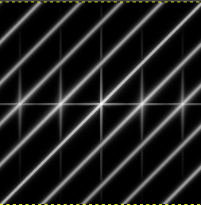
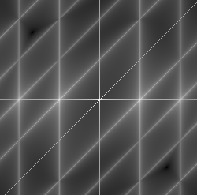
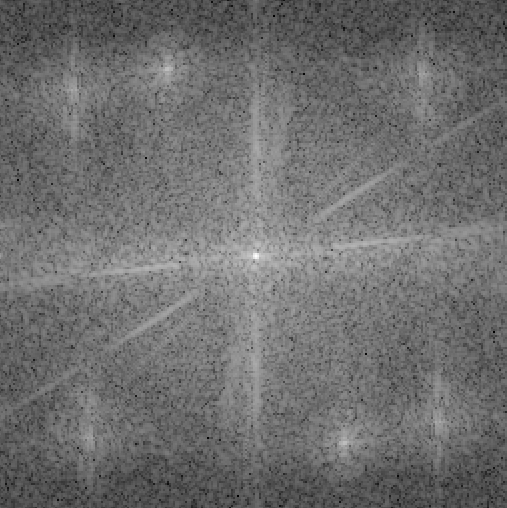
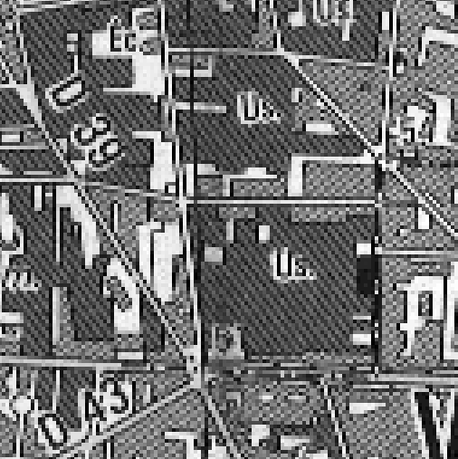
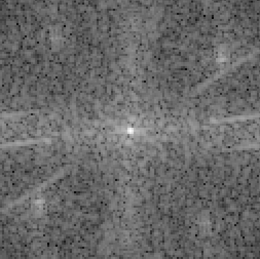
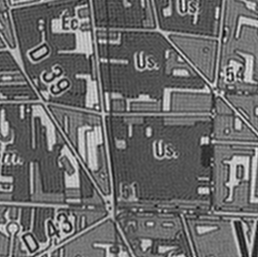
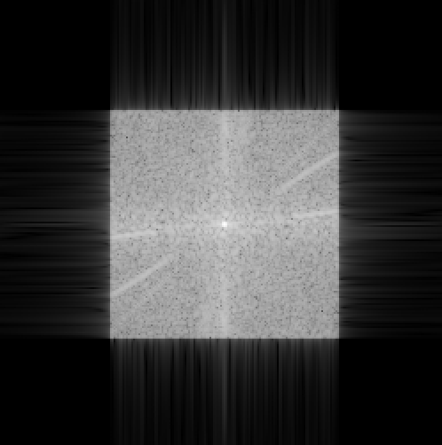

# TP1 Contraste

## Visualisation et utilisation de gimp

2.1) Pour afficher l'image en plus grand, gimp affiche chque pixel de l'image sur plusieurs pixels de l'écran. Par exemple, pour un zoom x2, un pixel de l'image prend 4 pixels de l'écran. 
Après mise à l'échelle de maison.tif, il y a repliement de spectre (apparition de bandes périodiques indésirables). L'image maison-petit.tif est moins détaillée mais il n'y a pas d'aliasing.

2.2) Le bouton hue permet de "naviguer" sur le cercle chromatique. En faisant un tour complet, on revient donc à la valeur de départ. C'est pour cela que -180° et 180° correspondent à la même couleur sur gimp. 
La saturation fait varier l'intensité des couleurs. A saturation minimale, l'image est en niveaux de gris.

## 3 Niveaux de gris, histogrammes et statistiques

3.1) Le bruit modifie l'histogramme en le lissant. 
L'ajout de bruit revient à sommer à la variable aléatoire correspondant à l'image, une variable aléatoire suivant une loi gaussienne. L'histogramme résultant représente donc la densité de la somme de ces deux variables, soit la convolution des deux densités.

3.2) L'application de fonctions croissantes à l'image ne modifie que légèrement son aspect global (les contrastes), sans la dénaturer. L'application de fonctions non croissantes à l'image modifie fortement son apparence. Dans le cas d'une fonction décroissante, les contrastes sont inversés.

3.3) sombre.jpg est éclaircie et on voit mieux les détails sombres sur l'image d'origine. 
De plus l'histogramme cumulé présente des sauts suivant la droite d'équation $y=x$. L'histogramme présente des pics sur certaines valeurs des abscisses.

3.4) Différence de vue1 et vue2 : Les détails sombres sur les deux images sont plus clairs. La source de lumière est rendu invisible car elle saturait sur les deux photos, et avait donc le même niveau. De plus la luminosité de la scène semble uniforme. 
En attribuant l'histogramme de l'une à l'autre, le résultat de la différence est une image presque noire. En effet, en attribuant à vue1 l'histogramme de vue2, vue1 devient identique à vue2.

3.5) L'ajout d'un seuil sur l'image non bruitée fait apparaître des surfaces monochromes noires ou blanches. L'image avec seuil est beaucoup mois détaillée que l'image d'origine. 
L'image bruitée à qui on a appliqué un sueil laiss apparaître plus de détails que l'image non bruitée

_Probabilité qu'un pixel devienne blanc_

Soit un pixel de niveau $x$, auquel on ajoute un bruit gaussien $b$, centré en 0. On a donc un pixel de niveau de gris $b+x$. 

- On suppose que le pixel est blanc, soit $x\simeq 255$. On a donc :  
  $P(x+b>127)\simeq P(b>-128)\simeq 1$
   En effet, le bruit est centré en 0, d'où la dernière égalité. 
  Ainsi, si un pixel est blanc, il le restera presque surement malgré l'ajout de bruit.
- On support que le pixel est noir, soit $x \simeq 0$. 
  $P(x+b>127)\simeq P(b>127)\simeq 0$ 
  Il est donc très peu probable qu'un pixel iniatialement noir devienne blanc après ajout de bruit et seuillage.
- Pour un pixel gris ($x\simeq 127$), on ne peut pas conclure avec précision. En effet, la probabilité qu'après ajout de bruit et seuillage, le pixel soit blanc est d'autant plus grande que le gris tend vers le blanc.

  3.6) L'histogramme de l'image de la différence des niveaux de gris présente un pic étroit en 0. Cela ne correspond pas à une distribution gaussienne. 
  La forme de l'histogramme est due au fait que dans un objet, les couleurs sont à peu près homogènes, donc la différence entre deux pixels voisins est proche de 0, d'où le pic marqué en 0. 
  Si on considère la différence de pixels plus éloignés, l'histogramme set plus étalé car ils peuvent, de manière plus problable appartenir à deux objets différents, et donc avoir une différence plus marquée.

## 4) Spectre des images et transformée de Fourier

4.1) Sur le spectre avec l'option 1 (affichage linéaire), on ne voit qu'une petite tâche blanche au centre de l'image. Le reste est noir. 
Avec l'option 2 (affichage logarithmique), on peut observer les composantes hautes fréquences du spectre. 
Cela montre que le spectre d'une image a une décroissance très rapide. Le module des hautes fréquences diffère de plusieurs ordres de grandeur par rapport aux basses fréquences. 
Rôle du fenêtrage : Sans fenêtre de Hamming, le spectre de l'image semble plus lisse qu'avec la fenêtre. Cela est dû à l'importance de l'amplitude des lobes secondaires dus au fentêtrage rectangulaire. Avec la fenêtre de Hamming, ces lobes sont amoindris, donc ils cachent moins les composantes de faible amplitude du spectre. (plus (+) de tâches noires)

**Spectre de l'image rayures.tif :** 

<!--   -->

 
On constate des motifs périodiques sur le spectre. La périodicité vient de l'échantillonage de l'image (formule de Poisson). Les rayures obliques proviennent la de la séparation de la séparation entre la zone rayée et la zone noire. Elles sont orthogonales à la ligne sur l'image.

**Influence de la fenêtre de Hamming :** 

<!--   -->

 
Le spectre a un fond gris qui correspond aux lobes secondaires dus au fenêtrage rectangulaire.

**Effet du sous-échantillonnage sur le spectre**

Image originelle : 

<!--   -->

 
Spectre de l'image : 

<!--  -->

Image sous-échantillonnée : 

<!--   -->

 
Spectre de l'image : 

<!--  -->

Sur l'image sous-échantillonnée, les rayures de certaines zones dans orthogonales et de fréquence différente de celles de l'image de base.

4.2)
**Effet d'un filtre passe bas parfait**

card_nb.tif à qui on a appliqué un filtre passe bas : 

<!--   -->

 
Spectre de l'image : 

<!--  -->

Les rayures de l'image de base on complètement disparu. En revanche on observe des formes parasites (ringing). Sur le spectre, on constate que les hautes fréquences on été coupées nettes.
Ces artéfacts sont dus à la conversion du filtre dans le domaine spatial. En effet, cela revient à convoluer l'image originelle par un signal en sinus cardinal, d'où l'apparition de ces "oscillations".

**Effet d'un filtre passe bas de Gauss**

Avec le filtre de Gauss, ces artefacts ne sont plus présents. En comparant les masques, on constate que la décroissance en intensité du filtre de Gauss est beaucoup plus lente que celle du filtre passe bas parfait (coupure nette à une fréquence donnée).

