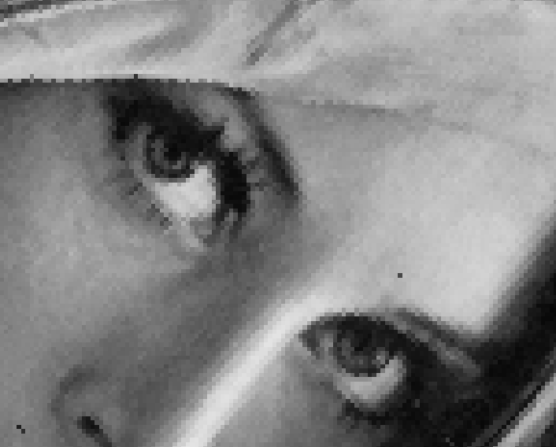
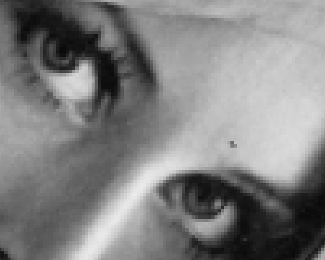
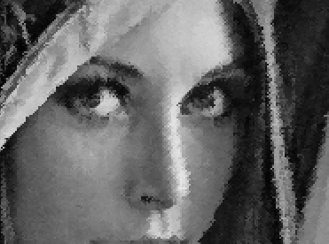
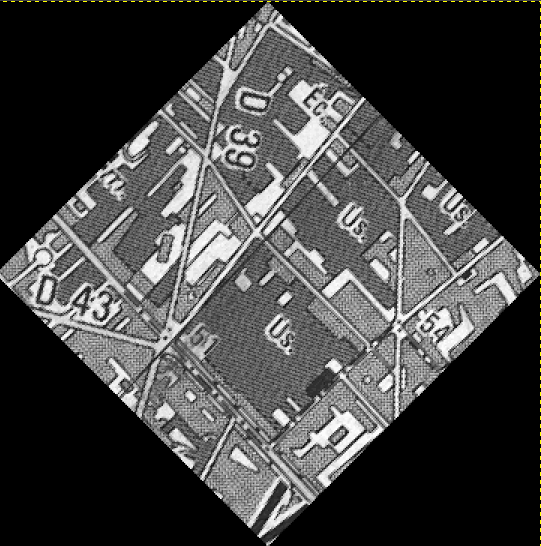
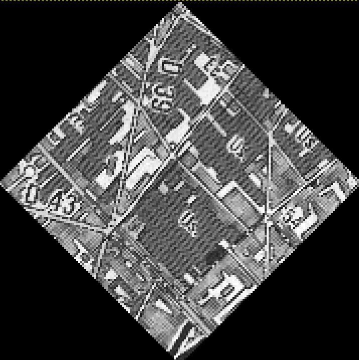
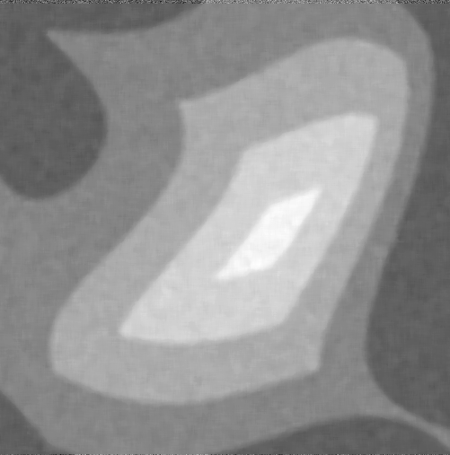
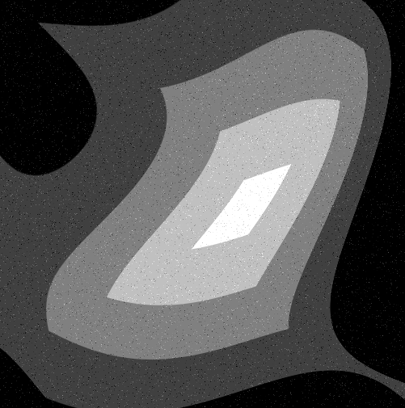
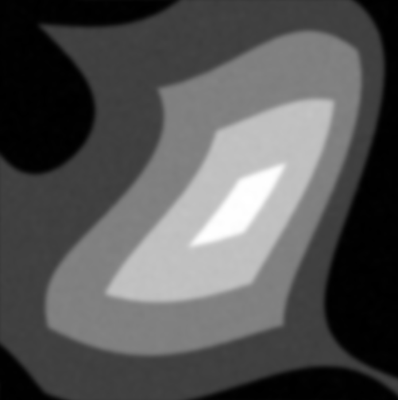
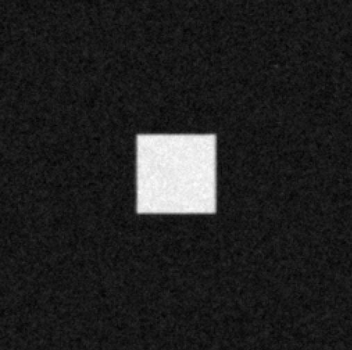

# TP2 Filtrage, restauration

## Transformation géométrique

<div style="text-align:center;">

<p>Interpolation par plus proches voisins</p>
</div>

<div style="text-align:center;">

<p>Interpolation bilinéaire</p>
</div>

Avec la méthode des plus proches voisins, on observe des seuils de couleurs entre les pixels, alors qu'avec la méthode bilinéaire, les transitions sont plus douces.

**Effet de 8 rotations de 45deg**<br>

<div style="text-align:center;">

<p>Image après 8 rotations et interpolation par plus proches voisins</p>
</div>

<div style="text-align:center;">

<p>Image après 8 rotations et interpolation bilinéaire</p>
</div>

Après 8 rotations avec la méthode des plus proches voisins, les détails de l'image sont déformés et on constate le même effet de seuillage que précédemment.<br>
Avec l'interpolation bilinéaire, la qualité de l'image est conservée.

**Rotation avec un facteur de zoom plus petit que 1**<br>

<div style="text-align:center;">

<p>Rotation avec zoom de 1</p>
</div>

<div style="text-align:center;">

<p>Rotation avec zoom de 0.5</p>
</div>
Avec un facteur de zoom de 0.5, on observe l'apparition d'aliasing. Cela est dû au sous-échantillonnage de l'image d'origine.<br>
Pour éviter l'aliasing, il aurait d'abord fallu filtrer les hautes fréquences avant de dézoomer l'image.

## Filtrage linéaire et médian

Le paramètre de la fonction get_gau_ker permet de choisir l'écart-type de la gaussienne. La taille du noyau est telle qu'on garde la gaussienne sur un intervalle de $5\sigma$.

Pour évaluer le bruit résiduel, on compare la variance d'une zone homogène de l'image bruitée avec la variance de cette même zone après filtrage. Sur une telle zone, la variance est de l'ordre de 900 sur l'image non filtrée, contre 10 après filtrage. (Filtre gaussien d'écart type 20).

<div style="text-align:center;">

<p>Application d'un filtre linéaire</p>
</div>

<div style="text-align:center;">

<p>Application d'un filtre médian</p>
</div>

Sur l'image filtrée avec un filtre médian, la variance du bruit gaussien est de l'ordre de 18, soit deux fois plus importante qu'avec le filtre gaussien. De plus, les niveaux de gris de l'image filtrée avec le filtre médian sont altérés. L'image est globalement plus claire.<br>
Un filtre médian est donc moins adapté qu'un filtre linéaire pour atténuer un bruit gaussien.

<div style="text-align:center;">

<p>Image avec bruit impulsionnel</p>
</div>

<div style="text-align:center;">

<p>Image filtrée avec un filtre linéaire</p>
</div>

<div style="text-align:center;">

<p>Image filtrée avec un filtre médian</p>
</div>

L'application d'un filtre médian sur pyra-impulse.tif élimine complètement le bruit impulsionnel de l'image, sans la flouter, tandis que le filtre gaussien n'élimine pas complètement le bruit et floute l'image.

## Restauration

L'application de filtre_inverse restitue fidèlement l'image d'origine.<br>
Si on ajoute très peu de bruit à 'limage filtrée, l'application de filtre_inverse restitue fidèlement d'limage d'origine, sans bruit.

Pour déterminer le noyau de convolution de l'image, on se place autour du pixel blanc, en haut à droite de l'image d'origine. Pour chaque pixel voisin, on détermine le résultat de la convolution avec le noyau, en faisant l'hypothèse qu'il est assez petit devant la distance entre la point blanc considéré et le carré. (Un noyau de taille 3 est suffisant).

<div style="text-align:center;"><p>Filtre de wiener avec lambda=1</p></div>

<div style="text-align:center;"><p>Filtre de wiener avec lambda=15</p></div>

Pour des valeurs de $\lambda$ plus petites que 15, le filtre de Wiener ne débruite presque pas l'image d'origine. Plus $\lambda$ est grand, plus le bruit est atténué.

## Application

**Comparaison entre filtrage linéaire et filtrage médian**<br>
Pour trouver la taille du filtre linéaire équivalent au filtre médian de rayon 4, on teste toutes les tailles en partant de 1, jusuqu'à atteindre un minimum de l'écart entre le bruit résiduel de l'image avec filtre médian et celui de l'image avec filtre linéaire. (minimisation de la dérivée entre chaque itération).<br>
Un filtre linéaire de taille 6 convient.

**Calcul théorique du paramètre de restauration**<br>
Sur la fonction fournie on modifie/ajoute les lignes suivantes :

```python
# Variance du bruit prise dans une zone homogène
sigma_b = var_image(im, 21, 21, 80, 80)*im.size

mul = np.conj(K)/(abs(K)**2+sigma_b/g**2)
```

Les résultats ne sont pas concluents.

<script type="text/javascript" src="http://cdn.mathjax.org/mathjax/latest/MathJax.js?config=TeX-AMS-MML_HTMLorMML"></script>
<script type="text/x-mathjax-config">
    MathJax.Hub.Config({ tex2jax: {inlineMath: [['$', '$']]}, messageStyle: "none" });
</script>
