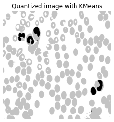

# TP3 Segmentation

## 1 Détection des contours

### 1.1 Filtre de gradient local par masque

- Intérêt du filtre de Sobel : Le noyau de convolution du filtre de Sobel est de taille 3x3. Il utilise donc le voisinage d'un pixel pour calculer son gradient, ce qui n'est pas le cas quand on fait simplement la différence entre deux pixels. Ainsi, le calcule du gradient avec le filtre de Sobel rend le résultat moins sensible au bruit.
- Il faut utiliser un filtre passe bas avant d'appliquer le filtre de Sobel pour se rapprocher de l'hypothèse de continuité de l'intensité.
- Seuillage

  - Plus le seuil augmente, moins les contours sont visibles. A partir d'un seuil à 0.2, les contours deviennent discontinus puisqu'on ne garde que les normes des gradients plus élevées.
    <div style="text-align:center;">
    
    <p>Image avec un seuil de 0.1</p>
    </div>
    <div style="text-align:center;">
    
    <p>Image avec un seuil de 0.2</p>
    </div>

    Avec un seuil trop bas, on observe l'apparition de bruit. La norme du gradient associée au bruit devient supérieure au seuil.

    <div style="text-align:center;">
    
    <p>Image avec un seuil à 0.05</p>
    </div>

    On constate en outre que les contours font plusieurs pixels d'épaisseur.

<script type="text/javascript" src="http://cdn.mathjax.org/mathjax/latest/MathJax.js?config=TeX-AMS-MML_HTMLorMML"></script>
<script type="text/x-mathjax-config">MathJax.Hub.Config({ tex2jax: {inlineMath: [['$', '$']]}, messageStyle: "none" });</script>

### 1.2 Maximum du gradient filtré dans la direction du gradient

- Critère de qualité optimisé par les max du gradient : Avec de procédé, on ne garde que les maxima du gradient pour dessiner les contours. Ceux-ci se trouvent sur 1 pixel à chaque fois. On obtient donc des contours plus fins sur l'image finale, après seuillage.

- Robustesse au bruit : De même que précédemment, si le seuil est trop bas (0.05 par exemple), on ne garde pas que les contours des cellules, mais aussi une partie du bruit.<br> En revanche, quand on augmente le seuil (au delà de 0.2), les contours deviennent discontinus, bien qu'il n'y ait plus de bruit.

<div style="text-align:center;">

<p>Image seuillée à 0.1</p>
</div>

<div style="text-align:center;">

<p>Image seuillée à 0.2</p>
</div>

<div style="text-align:center;">

<p>Image seuillée à 0.05</p>
</div>

- Pour la suite, on fixe le seuil à 0.15. Pour cette valeur du seuil, les contours sont continus et le bruit est minimum.

### 1.3 Filtre récursif de Deriche

Le code de dericheGradX et dericheGradY a été modifié de la façon suivante :

```python
b1[j] = l[j-1] + 2*ae*b1(j-1) - (ae**2)*b1(j-2)
# ...
b2[j] = l[j+1] + 2*ae*b2[j+1] - (ae**2)*b2[j+2]
```

- Effet du paramètre $\alpha$ : Plus $\alpha$ diminue, moins l'image est bruitée.

<div style="text-align:center;">

<p>cell.tif avec alpha = 1 et seuil = 3</p>
</div>

<div style="text-align:center;">

<p>cell.tif avec alpha = 0.5 et seuil = 1</p>
</div>

**Faire pareil avec muscle.tif**

- Temps de calcul : Le temps de calcul ne semble pas dépendre de $\alpha$. En effet, modifier la valeur de $\alpha$ ne change pas le nombre d'opérations effectuées sur chaque pixel.
-
- Les fonctions **dericheSmoothX** et **dericheSmoothY** servent à lisser l'image (filtre passe bas) afin de se rapprocher de l'hypothèse de continuité de l'intensité, pour ensuite appliquer la détection de contours.

### 1.4 Passage par 0 du laplacien

- Infleunce de $\alpha$ : Plus $\alpha$ diminue, plus les contours ressortent. <br> En revanche, les contour deviennent de moins en moins arrondis. Pour une valeur de $\alpha$ inférieure à 0.2, les contours deviennent indicernables.

<div style="text-align:center;">

<p>cell.tif avec alpha = 0.5/p>
</div>

<div style="text-align:center;">

<p>cell.tif avec alpha = 0.1</p>
</div>

- Le résultat obtenu avec le laplacien sur cell.tif ne fait pas ressortir les contours de manière aussi nette qu'avec les autres méthodes.

<div style="text-align:center;">

<p>Contours de cell.tif avec laplacien</p>
</div>

- Sur pyramide.tif on observe des lignes parasites sur les zones de l'image censées être homogènes.

<div style="text-align:center;">

<p>pyramide.tif avec laplacien</p>
</div>

Ce problème semble survenir sur les zones homogènes de l'images, donc sur les zones où le gradient est très faible ou nul. Il faut donc le seuiller pour forcer la mise à zéro des zones où iil a une faible valeur

### 1.5 Changez d'image

pyra-gauss.tif est bruitée. On ne peut donc pas utiliser le laplacien car il est trop sensible aux faibles variations de gradient.
<br> Dans ce cas, la meilleure alternative est un filtre de Deriche.

<div style="text-align:center;">

<p>pyra-gauss avec un filtre de Deriche (alpha=0.2 et seuil=4)</p>
</div>

## 2. Seuillage avec hystérésis

### 2.1 Application à la détection de ligne

- Influence du rayon :<br>
  Plus le rayon est élevé, plus les contours ressortent.

<div style="text-align:center;">

<p>spot.tif avec rayon=3</p>
</div>

<div style="text-align:center;">

<p>spot.tif avec rayon=7</p>
</div>

<div style="text-align:center;">

<p>spot.tif avec rayon=15</p>
</div>

- Influence des seuils :<br>
  En diminuant le rayon bas, cela fait apparaître les routes plus clairement sans nécessiter l'augmentation du rayon.

<div style="text-align:center;">

<p>seuil_bas=1, seuil_haut=5, rayon=9</p>
</div>

De plus, si on augmente trop le rayon, les plus petites routes sont moins nettes.

<div style="text-align:center;">

<p>seuil_bas=1, seuil_haut=5, rayon=13</p>
</div>

- seuil_bas=1, seuil_haut=8, rayon=7 semblent être des bon paramètres.

<div style="text-align:center;">

<p></p>
</div>

- Application du seuillage par hystérésis :<br>
  ...

## 3. Segmentation par classification : K-moyennes

### 3.1 Images à niveau de gris

- Algorithme des k-moyennes avec 2 classes : <br>

<div style="text-align:center;">

<p>cell.tif avec 2 classes pour les k-moyennes</p>
</div>

On constate que l'on n'est pas en mesure d'identifier les cellules différentes. En effet, avec deux classes, on est seulement en mesure d'identifier les zones de l'image qui sont des cellules, et des zones qui ne le sont pas. C'est pour cela que toutes les cellules sont noires et le fond blanx.<br>
Pour remédier à ce problème, il faut ajouter une troisième classe :

<div style="text-align:center;">

<p>cell.tif avec 3 classes</p>
</div>

L'ajout d'une classe permet effectivement de mettre en évidence les cellules différentes.

- Initialisation des classes :<br>
  Pour 3 classes, que ce soit avec des centres placés de manière déterministe ($random\_state \in N$), ou de manière aléatoire, le résultat est toujours le même.

  L'ajout de classes supplémentaires n'altère pas la mise en évidence des cellules différentes.

- Cas de muscle.tif<br>
  Dans le cas de mucle.tif, il faut distinguer plusieurs types de fibres. Cependant, chaque type a trop de nuances. Il n'est donc pas possible de les distinguer précisément.

<div style="text-align:center;">

<p>muscle.tif avec 4 classes pour les k-moyennes</p>
</div>

On constate des zones noires sur des cellules globalement grises, alors qu'elles ne sont pas censées être dans la même classe que les cellules complètement noire.

- Intérêt du filtrage :
  Un filtrage préalable de l'image permet de diminuer les nuances sur les fibres. Il est donc plus simple d'identifier les différents types de fibres.

### 3.2 Image en couleur

L'image est restituée avec 10 couleurs au maximum, contre les $256^3$ possible a priori. La restitution des couleurs est donc moins riche. Les nuances ressortent moins.

<div style="text-align:center;">

<p>fleur.tif quantifié</p>
</div>

Dans une image codée sur 3 octets, il peut potentiellement y avoir $256^3$ couleurs différentes. Il faudrait donc autant de classes pour être sûr de restituer parfaitement l'image d'origine.

Pour retrouver les couleurs qui composent carte.tif, au augmente le nombre de classes de l'algorithme des k-moyennes pour minimiser l'écart de couleur entre l'image initiale et l'image quantifiée.

## Seuillage automatique : Otsu

- Paramètre optimisé :
  Le script cherche à minimiser la variance intraclasse à partir de l'histogramme de l'image.

<div style="text-align:center;">

<p>cell.tif avec seuillage d'ostu</p>
</div>

<div style="text-align:center;">

<p>carte.tif avec seuillage d'otsu</p>
</div>

<div style="text-align:center;">

<p>lena.tif avec seuillage d'otsu</p>
</div>

<div style="text-align:center;">

<p>muscle.tif avec seuillage d'otsu</p>
</div>

Cette méthode ne semble pas efficace pour la segmentation d'une image de norme de gradient.

<div style="text-align:center;">

<p>Seuillage de la norme du gradient de carte.tif</p>
</div>

Certains éléments importants de l'image sont absents sur la version seuillée.

- Seuillage à 3 couleurs :

```python
def otsu_thresh2(im):

    h=histogram(im)
    m=0

    for i in range(256): # Moyenne globale
        m=m+i*h[i]

    maxt1=0
    maxt2=0
    maxk=0

    for t1 in range(256):
        w0=0
        m0=0
        for i in range(t1):
            w0=w0+h[i]
            m0=m0+i*h[i]
        if w0 > 0:
            m0=m0/w0

        for t2 in range(t1,256):

            w1=0
            w2=0

            m1=0
            m2=0

            for i in range(t1, t2): # Entre t1 et t2
                w1=w1+h[i]
                m1=m1+i*h[i]
            if w1 > 0:
                m1=m1/w1

            for i in range(t2, 256): # Entre t2 et 255
                w2=w2+h[i]
                m2=m2+i*h[i]
            if w2 > 0:
                m2=m2/w2

            k=w0*(m0-m)**2+w1*(m1-m)**2+w2*(m2-m)**2  # Variance interclasse

            if k > maxk: # Maximisation de la variance
                maxk=k
                maxt1=t1
                maxt2=t2

    thresh1,thresh2=maxt1,maxt2

    return(thresh1,thresh2)
```

<div style="text-align:center;">

<p>Résultat d'un seuillage à 3 niveaux (t1=91, t2=151)</p>
</div>

## 5. Croissance de régions

Le script region_growing.py fait grandir ajoute plusieurs pixels à la zone que l'on souhaite faire croitre. Pour que des pixels soient ajoutés à la zone en expansion, il faut que la moyenne de leur niveau de gris soit proche de celle du germe de départ. Cette proximité est fixée par un seuil.

```python
# Partie du code de region_growing correspondant à la comparaison de la couleur moyenne de la zone courant et de celle du germe :
if np.abs(m0-m) < thresh * s0 :
            mask[y][x]=255
            modif=1
```

Le paramètre **thres** correspond à l'écart acceptable entre la couleur de la zone considérée et celle de la zone en expansion.

Ainsi, plus **thres** est grand, plus l'objet final sera étendu, étant donné que l'on permet un plus grand écart de couleur.

<div style="text-align:center;">

<p>Segmentation avec seuil à 2</p>
</div>

<div style="text-align:center;">

<p>Segmentation avec seuil à 5</p>
</div>

Les paramètres de la dernières image semblent convenir pour segmenter correctement la matière blanche.<br>
Soit : $seuil=5, (x_0,y_0)=(300,300), rayon=5$

Pour tenter de segmenter la matière grise, on prend un point d'origine se trouvant dans la zone à étendre. On choisit $(x_0,y_0)=(345,129)$<br>
On ne parvient cependant pas à n'isoler que la matière grise. Les contours du crâne ressortent aussi.

<div style="text-align:center;">

<p>Tentative de segmentation de la matière grise</p>
</div>

- prédicat du script :
  L'écart entre la couleur moyenne d'une zone considérée et de la zone à étendre est inférieur au seuil **thres**

- Autre méthode :<br>
  On peut utiliser d'autres méthodes telles que le partage de région comme la méthode Suk. Dans cet algorithme, on considère un prédicat différent pour chaque région.
